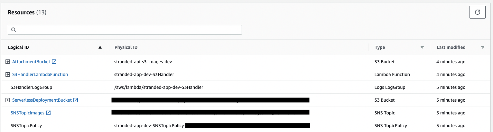

# Lambda Topic S3Handler

An AWS lambda function that process SNS events from an S3 bucket and prints to the console the information related to the events

- This lambda function was uploaded as a docker container image to the **AWS Elastic Container Registry**
- Written in **Swift 5.6**
- The AWS Lambda custom runtime was provided by the [swift-server/swift-aws-lambda-runtime](https://github.com/swift-server/swift-aws-lambda-runtime)
- The CI/CD is handled by **Github Actions**
    - **Secrets** variables are injected into the Github repository

The following resources were created



## Outputs

```
functions:
  S3Handler: stranded-app-dev-S3Handler

Stack Outputs:
  SNSTopicImagesArn: arn:aws:sns:us-east-2:*****:stranded-app-dev-SNSTopicImages-17Q7UW7OR51DH
  SNSTopicPolicyArn: stranded-app-dev-SNSTopicPolicy-ONQNTNERWXSG
  ServerlessDeploymentBucketName: stranded-app-dev-serverlessdeploymentbucket-16zm2z6x8g51
  S3HandlerLambdaFunctionQualifiedArn: arn:aws:lambda:us-east-2:*****:function:stranded-app-dev-S3Handler:27
```

### S3Event CloudWatch Logs
```
2022-07-30T15:25:10+0000 info com.idelfonso.aws-s3-lambda-handler : processing s3 event record with key S3Event(records: [AWSLambdaEvents.S3Event.Record(eventVersion: "2.1", eventSource: "aws:s3", awsRegion: AWSLambdaEvents.AWSRegion(rawValue: "us-east-2"), _eventTime: AWSLambdaEvents.ISO8601WithFractionalSecondsCoding(wrappedValue: 2022-07-30 15:25:03 +0000), eventName: "ObjectCreated:Put", object: AWSLambdaEvents.S3Event.Object(key: "AWS_CDK_demonstration_command.txt", size: Optional(2744), urlDecodedKey: nil, versionId: nil, eTag: "a28756608c5921ea101bb3b1c8d80062", sequencer: "0062E54D4F6D9EED3E")))])
```